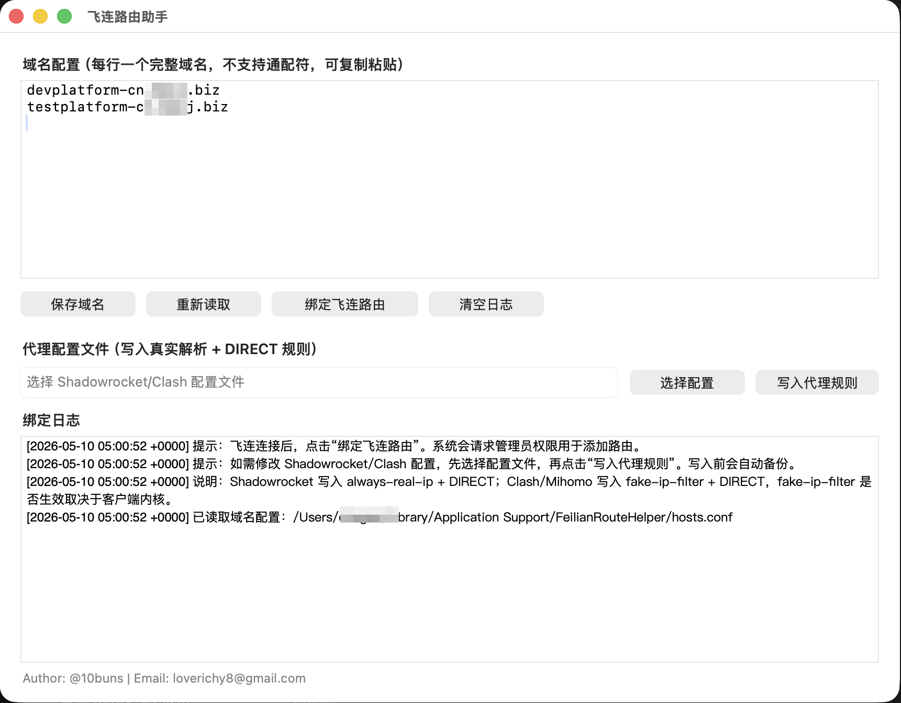

# Feilian Route Helper

[中文](README.md) | [English](README.en.md)

A lightweight macOS desktop utility for binding internal IPs resolved from specific company domains to the Feilian VPN route when Feilian VPN is used together with Shadowrocket, Clash, or Mihomo.

## Screenshot



Author: [@10buns](https://github.com/10buns)  
Email: loverichy8@gmail.com

## Features

- Configure domain lists visually with copy-and-paste support
- Enter one full domain per line and resolve domain IPs automatically
- Detect the Feilian `utun` VPN interface automatically
- Bind resolved IPs to the Feilian route with one click
- Show binding logs
- Write Shadowrocket `.conf` rules
- Write Clash / Mihomo `.yaml` / `.yml` rules
- Back up the original proxy config before writing changes
- Refresh the macOS DNS cache automatically after proxy rules are written

## Use Case

This tool is useful when the system is running both:

- Feilian: company VPN
- Shadowrocket / Clash / Mihomo: personal proxy

and you want specific company domains, for example:

```text
devplatform-cn.abc.biz
```

to bypass the personal proxy and be accessed through Feilian VPN instead.

## Build

Requirements:

- macOS
- Xcode Command Line Tools

Build:

```bash
./scripts/build.sh
```

Build artifact:

```text
dist/飞连路由助手.app
```

## Release

GitHub Actions is configured to publish releases automatically. After a `v*` tag is pushed, Actions builds the app on macOS and uploads the packaged `.app` as release assets.

```bash
git tag v1.0.0
git push origin v1.0.0
```

Release assets:

```text
FeilianRouteHelper-v1.0.0-macOS.zip
FeilianRouteHelper-v1.0.0-macOS.zip.sha256
```

## Usage

1. Connect to Feilian VPN
2. Open `飞连路由助手.app`
3. Enter full domains in the domain text box, one domain per line
4. Click `保存域名`
5. If the website uses 30x redirects, click `补全跳转域名`
6. To update a proxy config, click `选择配置` and select a Shadowrocket `.conf` file or a Clash / Mihomo `.yaml/.yml` file
7. Click `写入代理规则`
8. Click `终端绑定路由`
9. Check the execution result in the log area

The terminal will show:

```text
需要输入当前 macOS 用户密码以获取 sudo 权限。
```

The app will open Terminal and run the binding script with `sudo`. Enter the current macOS user password when prompted.

Domain configuration is saved at:

```text
~/Library/Application Support/FeilianRouteHelper/hosts.conf
```

## Writing Proxy Rules

### Shadowrocket `.conf`

The tool writes or merges:

```ini
[General]
always-real-ip = abc.biz, *.abc.biz, devplatform-cn.abc.biz

[Rule]
DOMAIN-SUFFIX,abc.biz,DIRECT
DOMAIN,devplatform-cn.abc.biz,DIRECT
```

### Clash / Mihomo `.yaml`

The tool writes or merges:

```yaml
dns:
  fake-ip-filter:
    - 'abc.biz'
    - '*.abc.biz'
    - 'devplatform-cn.abc.biz'

rules:
  - DOMAIN-SUFFIX,abc.biz,DIRECT
  - DOMAIN,devplatform-cn.abc.biz,DIRECT
```

Note: Whether `fake-ip-filter` takes effect depends on the Clash / Mihomo client and core configuration. If it does not take effect, the tool still falls back to real DNS resolution and Feilian route binding.

## Handling 30x Redirects

If a website redirects to another domain, click `补全跳转域名` first. The tool follows `http` / `https` redirects for the current domains and appends every `Location` host plus the final redirected host to the domain list.

After that, run these steps again:

1. `写入代理规则`
2. Reload the config in Shadowrocket / Clash / Mihomo
3. `终端绑定路由`

## DNS Refresh

After proxy rules are written successfully, the tool refreshes the macOS DNS cache automatically:

```bash
dscacheutil -flushcache
killall -HUP mDNSResponder
```

This operation may require administrator authorization.

## Route Binding Logic

The tool will:

1. Read full domains from the domain list
2. Resolve domain IPs using macOS DNS
3. Skip `198.18.*` / `198.19.*` fake IPs
4. Automatically scan current `utun` interfaces, skip common proxy fake-IP ranges, and detect the private or fast-mode address assigned by Feilian
5. Run a command similar to:

```bash
route -n add -host <resolved-ip> -interface <feilian-utun-interface>
```

Route binding requires administrator privileges.

## Notes

- Wildcard domains such as `*.abc.biz` are not supported as route binding input
- macOS routes work by IP, so the tool resolves full domains first and then binds the resolved IPs
- Temporary routes may become invalid after Feilian reconnects, the network changes, or the system restarts
- After Feilian reconnects, it is recommended to open the app and click `终端绑定路由` again
- The long-term stable solution is still to let the Feilian client or Feilian admin backend distribute the required internal routes

## License

MIT
